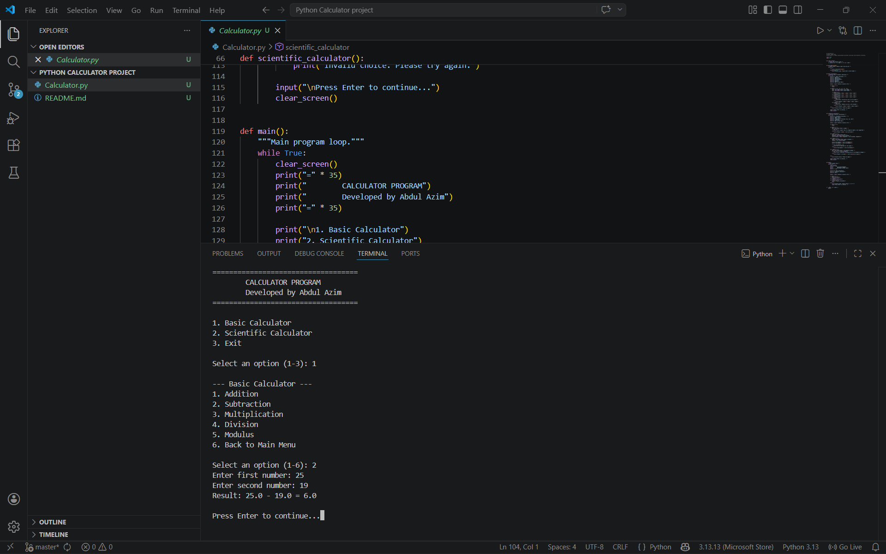

#  Calculator-Python-by-AZIM

## Simple Calculator

A command-line calculator made by ABDUL AZIM

## Features
- Basic arithmetic (add, subtract, multiply, divide)
- Scientific operations (square root, power, trig)
- Input validation and error handling
- Clean terminal interface

## How to Run
```bash
index.py
```

## Screenshot


---
Made by **ABDUL AZIM**
